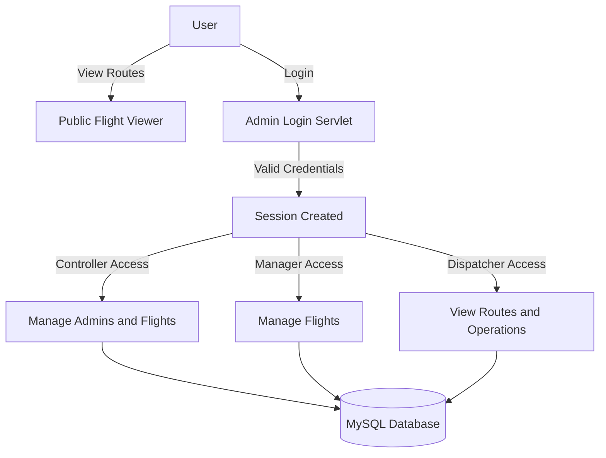

# ✈️ Flight Operations System


---

# 📝 Project Description

**Flight Operations System** is a role-based web application developed using **Java Servlets, JDBC, MySQL, HTML, and CSS**.

The system enables secure admin authentication, flight route management, admin access control, and public flight route viewing through a modern aviation-themed interface.

Developed using:
- NetBeans IDE
- GlassFish Server
- MySQL Database

The project follows a servlet-based MVC architecture and demonstrates concepts like:
- CRUD Operations
- JDBC Connectivity
- Session Management
- Role-Based Access Control
- Responsive UI Design

---

# ✨ Features

## 🌍 Public Flight Route Viewer
- View available flight routes without login
- Responsive flight route table
- Modern aviation-inspired UI

## 🔐 Secure Authentication
- Admin login system using Java Servlets
- Session-based authentication
- Role validation for protected operations

## 👑 Controller Access
Controllers can:
- Add Managers
- Delete Managers
- Manage Admin Accounts
- Perform complete Flight CRUD operations

## 🧑‍💼 Manager Access
Managers can:
- Add Flights
- Update Flight Information
- Delete Flights
- Manage Routes

## 👀 Dispatcher Access
Dispatchers can:
- View operational routes
- Access flight information in read-only mode

## 🗄️ Database Integration
- JDBC-based MySQL connectivity
- Multiple relational tables
- Structured aviation data management

---

# 🧰 Tech Stack

| Layer | Technology |
|-------|-------------|
| Frontend | HTML5, CSS3 |
| Backend | Java Servlets, JDBC |
| Database | MySQL |
| Server | GlassFish Server |
| IDE | NetBeans IDE |
| Architecture | MVC Architecture |

---

# 🏗️ System Architecture

The system follows a 3-tier architecture:

- Presentation Layer → HTML/CSS UI
- Business Logic Layer → Java Servlets
- Data Layer → MySQL Database

---

# 👥 Role-Based Access Control

| Role | Permissions |
|------|--------------|
| Controller | Manage Admins + Full Flight CRUD |
| Manager | Flight CRUD Operations |
| Dispatcher | View Operational Records |
| Public User | View Flight Routes |

---

# 🔁 Workflow Diagram



---

# 🗄️ Database Design

## Database Name

```sql
flight_ops
```

---

## 📂 Main Tables

| Table | Purpose |
|------|----------|
| flight905 | Stores flight details |
| admin905 | Stores admin credentials |
| log905 | Stores operational logs |

---

# 🧩 Table Structure

## ✈️ flight905

| Field | Type | Description |
|------|------|-------------|
| flight_id | INT | Unique Flight ID |
| flight_number | VARCHAR | Flight Number |
| route_code | VARCHAR | Route Path |
| airline_name | VARCHAR | Airline Name |
| destination_country | VARCHAR | Destination Country |

---

## 👤 admin905

| Field | Type | Description |
|------|------|-------------|
| admin_id | INT | Unique Admin ID |
| username | VARCHAR | Admin Username |
| password_hash | VARCHAR | Password |
| email | VARCHAR | Admin Email |
| role | VARCHAR | Access Role |

---

## 📋 log905

| Field | Type | Description |
|------|------|-------------|
| log_id | INT | Log Record ID |
| action_type | VARCHAR | CRUD Operation |
| flight_number | VARCHAR | Related Flight |
| action_time | DATETIME | Action Timestamp |
| admin_id | INT | Admin Reference |

---

# 🔐 Authentication Flow

1. User enters credentials.
2. Servlet validates credentials using JDBC.
3. Session is created for authenticated users.
4. Role-based permissions are verified.
5. User is redirected to appropriate dashboard.

---

# 🧾 CRUD Operations

## Flight CRUD
- Add Flights
- View Flights
- Update Flights
- Delete Flights

## Admin CRUD
- Add Managers
- Remove Managers
- Manage Roles

---

# 📸 Project Screenshots

## 🏠 Home Page


---

## 🔐 Admin Login


---

## 🌍 Flight Routes Viewer


---

## 🛫 Manage Flights Panel


---

## 👑 Controller Dashboard


---

# 📁 Suggested Folder Structure

```text
FlightOperationSystem/
│
├── src/
│   ├── java/
│   │   ├── AdminLogin.java
│   │   ├── Admin.java
│   │   ├── Routes.java
│
├── web/
│   ├── index.html
│   ├── style/
│   ├── images/
│
├── nbproject/
├── build/
├── dist/
├── README.md
```

---

# ⚙️ Setup Instructions

## 🧱 Prerequisites

- JDK 8+
- NetBeans IDE
- GlassFish Server
- MySQL Server
- JDBC Connector

---

# 🛢️ Database Setup

```sql
CREATE DATABASE flight_ops;

USE flight_ops;

CREATE TABLE admin905 (
    admin_id INT PRIMARY KEY,
    username VARCHAR(50),
    password_hash VARCHAR(255),
    email VARCHAR(100),
    role VARCHAR(30)
);

CREATE TABLE flight905 (
    flight_id INT PRIMARY KEY,
    flight_number VARCHAR(20),
    route_code VARCHAR(20),
    airline_name VARCHAR(50),
    destination_country VARCHAR(50)
);

CREATE TABLE log905 (
    log_id INT PRIMARY KEY,
    action_type VARCHAR(20),
    flight_number VARCHAR(20),
    action_time DATETIME,
    admin_id INT
);
```

---

# 🔌 JDBC Configuration

```java
Connection con = DriverManager.getConnection(
    "jdbc:mysql://localhost:3306/flight_ops",
    "root",
    "your_password"
);
```

---

# 🌐 GlassFish Configuration

1. Open NetBeans
2. Add GlassFish Server
3. Add MySQL Connector JAR
4. Deploy Project
5. Run Application

---

# ▶️ Run the Project

```bash
git clone https://github.com/your-username/FlightOperationSystem.git
```

Open in NetBeans and deploy using GlassFish.

Access:
```text
http://localhost:8080/Project
```

---

# 🎨 UI Highlights

- Dark futuristic aviation theme
- Neon blue glow effects
- Responsive tables
- Modern admin dashboard
- Clean authentication pages

---

# 🛡️ Security Features

- Session-based authentication
- Role-based authorization
- Prepared Statements
- Restricted admin operations

---

# 🚀 Future Enhancements

- Password Hashing
- Real-time Flight Tracking
- Flight Scheduling System
- Search & Filtering
- Analytics Dashboard
- JWT Authentication

---

# ⚙️ Challenges Faced

- Managing JDBC connections
- Implementing role-based access
- Session handling
- GlassFish configuration
- Responsive dashboard design

---

# 📘 Learning Outcomes

✔ Java Servlet Development  
✔ JDBC Integration  
✔ MySQL Database Design  
✔ Session Management  
✔ CRUD Architecture  
✔ Role-Based Authentication  
✔ MVC Web Architecture  

---

# 👩‍💻 Author

## Tanvi Tater

B.Tech CSE Student  
Java Full Stack & Web Development Enthusiast

---

# ⭐ Project Highlights

✅ Role-Based Authentication  
✅ Complete Flight CRUD System  
✅ Admin Management Panel  
✅ Public Route Viewer  
✅ JDBC + MySQL Integration  
✅ Modern Aviation-Themed UI  
✅ Servlet-Based Architecture  

---

# 📄 License

This project is developed for academic and learning purposes.
